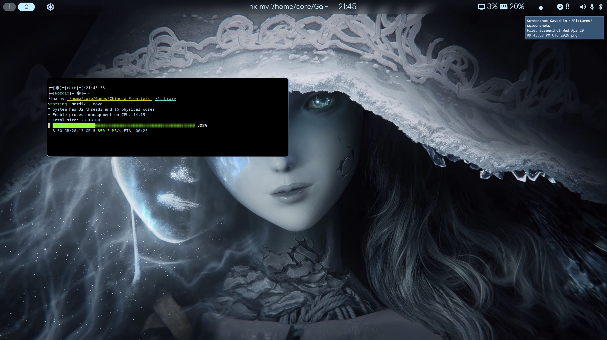

# ZPOOL - HHD

**Part of:** [Nordix](https://github.com/jimmykallhagen/Nordix)  
**Author:** Jimmy Källhagen  
**License:** GPL-3.0-or-later

## **This is a guide to creating an optimal and fast additional storage volume for home use**

---
**Redundancy**
>If you have very important data you may need to consider some form of redundancy, in my opinion you want to run HHD in stripe to be able to have a nice home system, but there are solutions to achieve this with other raid configurations in combination with l2arc, special vdev and slog in combination with the options sync=always on the dataset, gives you a zpool with rudundas and very smooth use and masks any limited performance, but it requires you to build your entire computer for this very purpose. If you instead want to create a simple but effective storage pool with simple means, I have an alternative solution to the redundancy problem. This involves partitioning your HHD into two parts, one that you run stripe on and a smaller one that you run mirror or raidz1. You can imagine that most of the media, such as Steam games libraries etc. can be downloaded again.
so you can now run it on the stripe part and then actually be able to use your HHD effectively for gaming, then have a second partition on your HHD which is then preferably run with zfs raidz1, you can then put critical data on it and then be safe
>
_I will add a guide to creating a combined stripe and raidz1 pool after the stripe pool guide, in written form I have not done this yet_

---

## Reach your system's full storage pool potential with ZFS

This is my own setup for a HHD zpool, 3 HGST 8TB, used with between 20-25 thousand hours of operation,
no bad sections, so they are perfect for acting as a fast, nice home lab zpool

Remember that the recommendations for ZFS are geared towards server and enterprise use,
for a regular home computer you will probably never have problems with healthy drives in the stripe.

>**_Always make sure your HHDs have good ventilation and that their mounting has vibration damping, if any of this is lacking in your setup you can drastically minimize the lifespan of your HHDs._**

> ⚠️**_ Never expose your HHD to shocks and make sure to never drop one while mounting, this is guaranteed to destroy it instantly._**⚠️
 
According to my tests with compression, you get varied results on media and games, 
but one factor that is the same is that it does not give a better compression ratio with a higher degree of compression, 
so for media and games I like to set fast compression, zstd-fast goes up to 1000 if you want to test it.

I recommend not using primarycache=all for a storage pool, it will fill up the ARC with files that are not important.
Instead I recommend using l2arc for hhd pools.

If you already have your system on an nvme you can create a zvol and use it as a cache for HHD (l2arc).

locate your drives and clean them first, be sure to get the right one otherwise it will be wrong.

locate:
```bash
lslbk
```
Clean:
```bash
sudo wipefs -a --force /dev/sdX
```
---

## Zpool create tank
This will create a fast Stripe hhd pool, make sure your hhd is in good condition and that it is okay. 
It will prepare options for the dataset you create later, so you don't have to specify options for each dataset if you don't want to.
it is recomend to use disk by-id when you create a zpool.

An easy way to check this is to go to directory /dev/disk/by-id/
and look for your current drive, copy it and use the full path in the zpool creation

Create zpool:
```bash
sudo zpool create -f -o ashift=12 \
-o autotrim=on \
-o feature@large_dnode=enabled \
-O redundant_metadata=most \
-O dnodesize=auto \
-O mountpoint=none \
-O compression=zstd-fast-500 \
-O recordsize=1M \
-O atime=off \
-O xattr=sa \
-O sync=standard \
-O checksum=fletcher4 \
-O acltype=off \
-O logbias=throughput \
-O primarycache=metadata \
-O secondarycache=all \
-o autoexpand=on \
tank /dev/disk/by-id/ata-HUH728080ALN600_2EHXRH1X /dev/disk/by-id/ata-HUH728080ALN600_VJG1PJBX /dev/disk/by-id/ata-HUH728080ALN600_VJG1U0SX
```
---

## **Special Vdev** - _a must_

This will add two SATA sdd disks in mirror for special vdevs, I prefer to just store metadata on them.
This is a large HHD pool for Virtual Machines, media and gaming, so setting the options to store small files on special vdevs is not really necessary.

Using SSD/NVME to store metadata on a HHD pool is something you should consider doing
as it gives a huge gain in latency and your large HHD pool now becomes a much nicer pool for both games and Virtual Machines.

I'm using older SATA SSDs (an old Intel and an old Kingstone) here that I don't completely trust, so I put them in a mirror,
then one can break and you have the chance to replace it, mirroring also gives increased read speed,
like stripe but only for reads, not for writes, which is not relevant for special vdev anyway.

remember that if you use a special vdev for metadata, all data on the entire zpool will be lost if you delete this special vdev

Special Vdev:
```bash
sudo zpool add -f -o ashift=12 tank special mirror /dev/disk/by-id/ata-INTEL_SSDSC2CW120A3_CVCV430601BD120BGN /dev/disk/by-id/ata-KINGSTON_SA400S37120G_50026B767B0067D9
```
---

## Dataset 

now we can create a dataset on this awesome tank and since we already set up the dataset options on this tank, they inherit these when we create new datasets, only if we want changed options do we need to set them, this time we run as the pool is prepared

I want to create a dataset for my media library, I name this library. I also want this to be automatically mounted in my home so I set canmount=on and mountpoint in my home under Library

Create dataset "library"
```bash
sudo zfs create \
-o mountpoint=/home/core/Library \
-o canmount=on \
tank/library
```
Make your user the owner:
```bash
sudo chown core:core -R /home/core/Library
```
---

Now I got a directory mounted in my home called Library, can we test this with nx-mv and see if we managed to get satisfactory results




